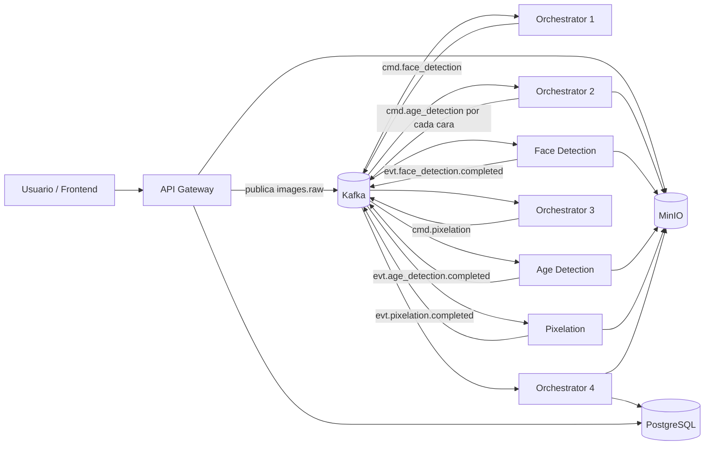

# Pixelado de Menores

Sistema distribuido basado en eventos para **detectar rostros en imágenes, estimar si cada persona es menor o adulta y pixelar automáticamente los rostros de menores de 18 años**.

El proyecto está pensado como una implementación académica, pero intentando acercarse a una arquitectura real: servicios separados, comunicación asíncrona con Kafka, almacenamiento en MinIO y trazabilidad del estado en PostgreSQL.


---

## Índice

- [Objetivo del proyecto](#objetivo-del-proyecto)
- [Características principales](#características-principales)
- [Arquitectura general](#arquitectura-general)
- [Tecnologías utilizadas](#tecnologías-utilizadas)
- [Instalación y ejecución](#instalación-y-ejecución)
- [Uso del sistema](#uso-del-sistema)
- [Estructura del proyecto](#estructura-del-proyecto)
- [Servicios del sistema](#servicios-del-sistema)
- [Topics y flujo de eventos](#topics-y-flujo-de-eventos)
- [Almacenamiento y base de datos](#almacenamiento-y-base-de-datos)
- [Modelo de detección de edad](#modelo-de-detección-de-edad)
- [Gestión de errores](#gestión-de-errores)
- [Problemas encontrados y soluciones aplicadas](#problemas-encontrados-y-soluciones-aplicadas)
- [Decisiones técnicas importantes](#decisiones-técnicas-importantes)
- [Aprendizajes](#aprendizajes)
- [Mejoras futuras](#mejoras-futuras)
- [Autores](#autores)

---

## Objetivo del proyecto

El objetivo principal es construir un pipeline distribuido que procese imágenes de forma automática para:

1. Recibir una imagen desde una API HTTP.
2. Detectar todas las caras presentes en la imagen.
3. Recortar cada cara y analizarla de forma independiente.
4. Clasificar cada rostro como **menor de edad** o **adulto**.
5. Pixelar únicamente los rostros clasificados como menores.
6. Guardar la imagen final y permitir su consulta posterior.

La parte importante no es solo el procesado de imágenes. También se busca demostrar el uso de una arquitectura **event-driven**, donde los servicios no se llaman directamente entre sí, sino que se coordinan mediante eventos publicados en Kafka.

---

## Características principales

- Arquitectura distribuida con varios microservicios independientes.
- Comunicación asíncrona mediante **Apache Kafka**.
- Pipeline coordinado por cuatro orquestadores.
- API REST con **FastAPI** para subir imágenes y consultar resultados.
- Detección facial con **YOLOv8**.
- Clasificación binaria de edad: menor `<18` frente a adulto `>=18`.
- Pixelado automático con **OpenCV**.
- Almacenamiento compatible con S3 mediante **MinIO**.
- Persistencia de estados, métricas y resultados en **PostgreSQL**.
- Procesamiento de múltiples caras por imagen, generando un evento por cada rostro.
- Frontend web sencillo para subir imágenes y seguir el pipeline con logs visuales.

---

## Arquitectura general

El sistema se divide en tres bloques:

- **Entrada y consulta:** API Gateway + frontend.
- **Procesamiento:** orquestadores, detección de caras, detección de edad y pixelado.
- **Infraestructura:** Kafka, PostgreSQL y MinIO.



A nivel práctico, las imágenes no viajan dentro de los mensajes de Kafka. Los eventos solo transportan metadatos: `guid_solicitud`, bucket, ruta en MinIO, bounding boxes y resultados del modelo. Esto evita mensajes pesados y hace que el flujo sea más limpio.

---

## Tecnologías utilizadas

| Área | Tecnología |
| --- | --- |
| Lenguaje principal | Python 3.11 |
| API REST | FastAPI |
| Bus de eventos | Apache Kafka, modo KRaft sin Zookeeper |
| Base de datos | PostgreSQL 16 |
| Almacenamiento de objetos | MinIO, compatible con S3 |
| Detección facial | YOLOv8 / Ultralytics |
| Detección de edad | PyTorch TorchScript en el servicio actual; entrenamiento documentado con transfer learning |
| Procesamiento de imagen | OpenCV, NumPy |
| Contenedores | Docker y Docker Compose |
| Entrenamiento del modelo | Google Colab, TensorFlow/Keras en los notebooks de entrenamiento |

---

## Instalación y ejecución

### Requisitos previos

- Docker Desktop o Docker Engine.
- Docker Compose.
- `curl`, para probar la API desde terminal.
- Puerto `8000` libre para la API.
- Puerto `9000` y `9001` libres para MinIO.
- Puerto `5432` libre para PostgreSQL.
- Puerto `9092` libre para Kafka.

### 1. Clonar el repositorio

```bash
git clone https://github.com/dariolopez05/pixelar-menores.git
cd pixelar-menores
```

### 2. Comprobar variables de entorno

El repositorio incluye un archivo `.env` con valores por defecto:

```env
POSTGRES_DB=facedb
POSTGRES_USER=faceuser
POSTGRES_PASSWORD=facepass

MINIO_ROOT_USER=minioadmin
MINIO_ROOT_PASSWORD=minioadmin
```

Para desarrollo local se pueden dejar tal cual. Para un despliegue real habría que cambiarlas.

### 3. Descargar o colocar el modelo de edad

El servicio `age-detection` necesita un modelo en:

```text
age-detection/model/resnet18_age_detection.pt
```

El repositorio trae un script para descargarlo desde Releases:

```cmd
scripts\download_model.bat
```

En Linux/macOS se puede hacer manualmente creando la carpeta y descargando el artefacto indicado en el propio script:

```bash
mkdir -p age-detection/model
curl -L -o age-detection/model/resnet18_age_detection.pt \
  https://github.com/dariolopez05/pixelar-menores/releases/download/v1.0-model/resnet18_age_detection.pt
```

> Nota: si el modelo no está disponible en Releases, será necesario entrenarlo o colocar manualmente el archivo esperado en `age-detection/model/` antes de levantar el contenedor.

### 4. Levantar todo el sistema

```bash
docker compose up -d --build
```

Con esto se levantan:

- Kafka
- PostgreSQL
- MinIO
- API Gateway
- Orchestrator 1
- Orchestrator 2
- Orchestrator 3
- Orchestrator 4
- Face Detection
- Age Detection
- Pixelation

Para ver el estado de los contenedores:

```bash
docker compose ps
```

Para ver logs en tiempo real:

```bash
docker compose logs -f
```

También se pueden consultar logs de un servicio concreto:

```bash
docker compose logs -f api-gateway
docker compose logs -f face-detection
docker compose logs -f age-detection
```

### 5. Accesos útiles

| Servicio | URL |
| --- | --- |
| Frontend / API Gateway | `http://localhost:8000` |
| Swagger de FastAPI | `http://localhost:8000/docs` |
| MinIO Console | `http://localhost:9001` |
| MinIO API | `http://localhost:9000` |

Credenciales de MinIO por defecto:

```text
usuario: minioadmin
contraseña: minioadmin
```

> En algunos entornos Linux, `host.docker.internal` puede no resolver igual que en Docker Desktop. Si las URLs firmadas de MinIO no abren en el navegador, revisar `MINIO_PUBLIC_ENDPOINT` en `docker-compose.yml` y ajustarlo a `localhost:9000` o a la IP correspondiente.

---

## Uso del sistema

El API Gateway incluye un **frontend web** accesible en `http://localhost:8000` una vez levantado el sistema. Desde ahí se puede subir una imagen, seguir el progreso del pipeline en tiempo real mediante logs visuales y ver el resultado final sin necesidad de usar la terminal.

Los siguientes comandos son la alternativa programática desde curl.

### Subir una imagen

```bash
curl -X POST http://localhost:8000/images \
  -F "file=@ejemplos/pexels-israwmx-17030111.jpg"
```

Respuesta esperada:

```json
{
  "guid_solicitud": "0f0b4b8f-...",
  "id_solicitud": 1,
  "estado": "PENDING"
}
```

El `guid_solicitud` es la clave para consultar el resultado después.

### Consultar una solicitud

```bash
curl http://localhost:8000/images/<guid_solicitud>
```

Mientras el pipeline está trabajando, la solicitud irá cambiando de estado. Cuando termine, el estado será `COMPLETED` y se devolverá la URL de la imagen procesada.

Ejemplo simplificado:

```json
{
  "id_solicitud": 1,
  "guid_solicitud": "0f0b4b8f-...",
  "estado": "COMPLETED",
  "url_resultado": "http://localhost:9000/processed-images/...",
  "metricas": {
    "num_imagenes_total": 3,
    "num_imagenes_pixeladas": 1,
    "duracion_total_ms": 4218
  }
}
```

### Listar solicitudes

```bash
curl "http://localhost:8000/images?limit=10&offset=0"
```

También se puede filtrar por estado:

```bash
curl "http://localhost:8000/images?estado=COMPLETED"
```

### Consultar una cara concreta

```bash
curl http://localhost:8000/images/<guid_solicitud>/cara/1
```

Devuelve información como:

- coordenadas del bounding box,
- URL del recorte de la cara,
- clasificación menor/adulto,
- score del modelo,
- estado del procesamiento de esa cara.

### Healthcheck

```bash
curl http://localhost:8000/health
```

---

## Estructura del proyecto

```text
pixelar-menores/
├── age-detection/              # Servicio que clasifica cada cara como menor/adulto
│   ├── Dockerfile
│   ├── main.py
│   ├── requirements.txt
│   └── model/                  # Modelo de edad esperado por el contenedor
│
├── api-gateway/                # API REST + frontend web
│   ├── Dockerfile
│   ├── main.py
│   ├── requirements.txt
│   └── frontend/
│       └── index.html
│
├── assets/                     # Diagrama y material de apoyo
│   ├── enunciado.md
│   └── flujo.jpeg
│
├── db/                         # Inicialización de PostgreSQL
│   └── init.sql
│
├── ejemplos/                   # Imágenes de prueba
│
├── face-detection/             # Detección de caras con YOLOv8
│   ├── Dockerfile
│   ├── main.py
│   ├── requirements.txt
│   └── yolov8n-face.pt
│
├── orchestrator-1/             # Inicio del pipeline: images.raw → cmd.face_detection
├── orchestrator-2/             # Recorte de caras y envío a detección de edad
├── orchestrator-3/             # Agregación de resultados de edad y decisión de pixelado
├── orchestrator-4/             # Cierre del pipeline y actualización final de la solicitud
│
├── pixelation/                 # Pixelado de rostros menores con OpenCV
│
├── reports/                    # Análisis del dataset y scripts de reporte
│
├── scripts/                    # Scripts .bat de apoyo para Windows
│
├── storage-service/            # Servicio preparado para un flujo alternativo de almacenamiento
│
├── training/                   # Scripts/notebooks de entrenamiento del modelo de edad
│
├── docker-compose.yml          # Definición completa de infraestructura y servicios
├── INSTRUCCIONES.md            # Notas de desarrollo y pruebas
└── README.md
```

### Nota sobre `storage-service/`

Existe un `storage-service` preparado para consumir `cmd.storage` y producir `evt.storage.completed`, pero **no está conectado en el `docker-compose.yml` actual**. En la versión actual el cierre del pipeline lo realiza `orchestrator-4`, generando la URL de la imagen procesada y marcando la solicitud como `COMPLETED`.

---

## Servicios del sistema

### API Gateway

**Carpeta:** `api-gateway/`

Es la entrada del sistema.

Responsabilidades:

- Recibir imágenes mediante `POST /images`.
- Guardar la imagen original en MinIO dentro de `raw-images`.
- Crear una fila inicial en la tabla `Solicitud`.
- Publicar el evento inicial en `images.raw`.
- Exponer endpoints para consultar solicitudes, caras y métricas.
- Servir el frontend web incluido en `api-gateway/frontend/`.

### Orchestrator 1

**Carpeta:** `orchestrator-1/`

Consume `images.raw` y marca el inicio real del pipeline.

Responsabilidades:

- Cambiar el estado de la solicitud a `FACE_DETECTION`.
- Registrar `Inicio_Deteccion_Caras`.
- Publicar `cmd.face_detection`.

### Face Detection Service

**Carpeta:** `face-detection/`

Servicio encargado de detectar rostros.

Responsabilidades:

- Consumir `cmd.face_detection`.
- Descargar la imagen original desde MinIO.
- Detectar caras usando YOLOv8.
- Publicar `evt.face_detection.completed` con la lista de bounding boxes.

Cada cara detectada incluye:

```json
{
  "num_cara": 1,
  "x": 120,
  "y": 80,
  "w": 64,
  "h": 64,
  "confianza": 0.91
}
```

### Orchestrator 2

**Carpeta:** `orchestrator-2/`

Se ejecuta después de la detección facial.

Responsabilidades:

- Consumir `evt.face_detection.completed`.
- Actualizar `Fin_Deteccion_Caras` y `Num_Imagenes_Total`.
- Descargar la imagen original una sola vez.
- Recortar cada cara con un margen configurable.
- Guardar los recortes en `face-crops`.
- Insertar una fila en `Imagenes` por cada rostro.
- Publicar un `cmd.age_detection` por cada cara.

Si no hay caras, publica directamente `cmd.pixelation` con una lista vacía para que la imagen original pase a `processed-images` sin cambios.

### Age Detection Service

**Carpeta:** `age-detection/`

Clasifica cada recorte de cara.

Responsabilidades:

- Consumir `cmd.age_detection`.
- Descargar el recorte desde `face-crops`.
- Aplicar el mismo preprocesamiento esperado por el modelo: conversión RGB, padding cuadrado y resize a 224x224.
- Calcular la probabilidad de que la cara pertenezca a un menor.
- Publicar `evt.age_detection.completed` con el resultado.

En la implementación actual, el servicio carga un modelo TorchScript desde:

```text
/app/model/resnet18_age_detection.pt
```

El umbral de clasificación se controla con la variable:

```env
MINOR_PROB_THRESHOLD
```

### Orchestrator 3

**Carpeta:** `orchestrator-3/`

Agrega los resultados de edad.

Responsabilidades:

- Consumir `evt.age_detection.completed`.
- Actualizar cada fila de `Imagenes` con edad representativa, score y si es menor.
- Esperar a que lleguen todos los resultados de una misma solicitud.
- Construir la lista de caras menores.
- Publicar `cmd.pixelation`.

Esta parte fue clave porque una imagen puede contener varias caras, y cada cara llega como evento independiente.

### Pixelation Service

**Carpeta:** `pixelation/`

Aplica el pixelado final.

Responsabilidades:

- Consumir `cmd.pixelation`.
- Descargar la imagen original desde MinIO.
- Pixelar solo las regiones marcadas como menores.
- Guardar la imagen final en `processed-images`.
- Publicar `evt.pixelation.completed`.

Si la lista de menores está vacía, copia la imagen original al bucket de procesadas sin modificarla.

### Orchestrator 4

**Carpeta:** `orchestrator-4/`

Cierra el flujo.

Responsabilidades:

- Consumir `evt.pixelation.completed`.
- Generar una URL firmada hacia la imagen final.
- Actualizar la tabla `Solicitud` con:
  - URL final,
  - fin de solicitud,
  - tiempos de pixelado y almacenamiento,
  - número de caras pixeladas,
  - estado `COMPLETED`.

---

## Topics y flujo de eventos

### Topics activos

| Topic | Tipo | Produce | Consume | Función |
| --- | --- | --- | --- | --- |
| `images.raw` | Evento inicial | API Gateway | Orchestrator 1 | Nueva imagen subida al sistema |
| `cmd.face_detection` | Comando | Orchestrator 1 | Face Detection | Solicita detección de caras |
| `evt.face_detection.completed` | Evento | Face Detection | Orchestrator 2 | Devuelve caras detectadas |
| `cmd.age_detection` | Comando | Orchestrator 2 | Age Detection | Solicita clasificación de una cara |
| `evt.age_detection.completed` | Evento | Age Detection | Orchestrator 3 | Devuelve clasificación menor/adulto |
| `cmd.pixelation` | Comando | Orchestrator 3 / Orchestrator 2 | Pixelation | Solicita pixelado de menores |
| `evt.pixelation.completed` | Evento | Pixelation | Orchestrator 4 | Indica que la imagen final está guardada |
| `dead.letter.queue` | Error | Cualquier servicio | — | Recibe eventos que han fallado durante el procesamiento |

### Topics preparados pero no usados en el flujo actual

| Topic | Estado |
| --- | --- |
| `cmd.storage` | Preparado para `storage-service`, no conectado en el compose actual |
| `evt.storage.completed` | Preparado para `storage-service`, no conectado en el compose actual |

### Flujo implementado

```text
Cliente / Frontend
  ↓ POST /images
API Gateway
  ↓ images.raw
Orchestrator 1
  ↓ cmd.face_detection
Face Detection
  ↓ evt.face_detection.completed
Orchestrator 2
  ↓ cmd.age_detection, uno por cada cara
Age Detection
  ↓ evt.age_detection.completed
Orchestrator 3
  ↓ cmd.pixelation
Pixelation
  ↓ evt.pixelation.completed
Orchestrator 4
  ↓
Solicitud COMPLETED + URL final en MinIO
```

---

## Almacenamiento y base de datos

### MinIO

Se usan tres buckets:

| Bucket | Contenido |
| --- | --- |
| `raw-images` | Imagen original subida por el usuario |
| `face-crops` | Recortes individuales de cada rostro detectado |
| `processed-images` | Imagen final, con menores pixelados o copia original si no hay menores |

### PostgreSQL

El sistema utiliza dos tablas principales.

#### `Solicitud`

Guarda el estado global de cada imagen procesada:

- `GUID_Solicitud`
- URL de imagen original
- URL de imagen terminada
- timestamps de cada fase
- número total de caras
- número de caras pixeladas
- estado actual

Estados usados en la implementación:

```text
PENDING → FACE_DETECTION → AGE_DETECTION → PIXELATION → COMPLETED
```

#### `Imagenes`

Guarda una fila por cada rostro detectado:

- número de cara,
- URL del recorte,
- bounding box,
- edad representativa,
- clasificación menor/adulto,
- score del modelo,
- estado.

---

## Modelo de detección de edad

El problema de edad se trató como una **clasificación binaria**:

```text
1 → menor de 18 años
0 → adulto, 18 años o más
```

El dataset base utilizado para el entrenamiento fue **Facial Age**, organizado por carpetas de edad.

Durante el desarrollo hubo varias iteraciones del modelo. En los materiales de entrenamiento se trabajó con transferencia de aprendizaje en Colab, especialmente con EfficientNetV2, porque entrenar localmente era demasiado lento para ir probando cambios. La versión desplegada en el servicio actual espera un modelo TorchScript en `age-detection/model/resnet18_age_detection.pt`.

### Ajustes realizados durante el entrenamiento

La parte más delicada fue la frontera entre menores y adultos jóvenes. Detectar bebés era relativamente fácil, pero los adolescentes de 13 a 17 años daban bastantes más problemas.

Para mejorar esto se aplicaron varias estrategias:

- Reducción del peso de edades con demasiadas imágenes, especialmente bebés.
- Refuerzo de edades críticas entre 13 y 17 años.
- Aumento de datos con transformaciones realistas.
- Entrenamiento en Google Colab para acelerar pruebas.
- Uso de pocas capas/neuronas en la cabeza clasificadora para reducir riesgo de sobreajuste.
- Comparación de umbrales antes de elegir el valor final de clasificación.

En una validación documentada se trabajó con un umbral de `0.60`, priorizando el recall de menores para reducir falsos negativos. En el `docker-compose.yml` el umbral aparece como variable configurable (`MINOR_PROB_THRESHOLD`), por lo que se puede ajustar sin tocar el código.

### Resultados documentados del modelo

En la presentación se documentó una validación con:

- 3028 imágenes de validación.
- 2276 adultos.
- 752 menores.
- Accuracy aproximado: 0.96.
- Recall de menores aproximado: 0.92.
- Matriz de confusión con 59 menores no detectados y 74 adultos pixelados por error.

Estos resultados son buenos para una práctica, pero no significan que el sistema sea perfecto. En un caso real haría falta más dataset, mejor balance por edad y género, y pruebas mucho más amplias.

---

## Gestión de errores

El sistema incluye una gestión básica de errores orientada a no perder completamente la trazabilidad del fallo.

Medidas implementadas:

- Reintentos de conexión a Kafka al arrancar servicios.
- Uso de healthchecks en Kafka, PostgreSQL y MinIO dentro de Docker Compose.
- Publicación de errores en `dead.letter.queue` cuando un servicio no puede procesar un mensaje.
- Registro de logs por servicio.
- Uso de PostgreSQL como fuente de verdad para saber en qué estado se encuentra cada solicitud.

Limitaciones actuales:

- La DLQ existe, pero no hay todavía un consumidor dedicado que reprocesa o visualiza esos mensajes.
- No hay política avanzada de reintentos por evento.
- La idempotencia no está resuelta al 100%; ante mensajes duplicados podrían aparecer casos a revisar.
- No hay dashboard específico de latencia o throughput, aunque la base de datos guarda timestamps suficientes para calcular tiempos por fase.

---

## Problemas encontrados y soluciones aplicadas

### 1. Detección facial con falsos positivos

Al principio el detector de caras podía marcar objetos o patrones que no eran rostros. También fallaba cuando había muchas personas en una imagen, sobre todo a partir de unas cinco caras.

**Solución aplicada:** se sustituyó el enfoque inicial por YOLOv8 para mejorar la robustez de la detección facial. Además, se conservaron bounding boxes, recortes y logs para poder revisar visualmente qué estaba ocurriendo.

### 2. Dificultad con adolescentes de 13 a 17 años

El modelo tendía a identificar bien bebés y adultos claros, pero fallaba más con adolescentes cercanos a la mayoría de edad. El problema venía en parte del desbalance del dataset: había muchas imágenes de edades muy bajas frente a muchas menos de adolescentes.

Un caso concreto detectado fue que la edad 1 tenía unas 1112 imágenes, mientras que el conjunto de edades 13-17 sumaba alrededor de 670 imágenes.

**Solución aplicada:** se redujo la influencia de edades sobrerrepresentadas y se reforzó el grupo 13-17 mediante oversampling y ajuste de pesos.

### 3. Mujeres adultas clasificadas como menores

Se observó que algunas mujeres adultas eran clasificadas como menores, generando falsos positivos en el pixelado.

**Posible causa:** el dataset podría estar desbalanceado también por género, aunque no se pudo confirmar con seguridad porque no se disponía de etiquetas fiables de género.

**Solución parcial:** revisar umbrales y métricas por rangos de edad. Se deja como mejora futura equilibrar mejor el dataset también por género.

### 4. Entrenamiento demasiado lento en local

Entrenar nuevos modelos en los ordenadores locales ralentizaba mucho las pruebas.

**Solución aplicada:** se movió el entrenamiento a Google Colab. Desde ahí se entrenaba el modelo, se descargaba el artefacto final y se integraba en el proyecto.

### 5. Riesgo de sobreajuste

Como el dataset no era enorme y además estaba desbalanceado, aumentar demasiado la complejidad de la red podía hacer que el modelo aprendiera detalles poco útiles.

**Solución aplicada:** usar una cabeza clasificadora moderada, regularización, dropout y aumentos de datos razonables.

### 6. Coordinación de múltiples caras

Una imagen puede tener una, ninguna o muchas caras. Además, cada cara se procesa de forma independiente y los eventos pueden llegar en distinto orden.

**Solución aplicada:** `orchestrator-3` acumula los resultados por solicitud y solo avanza al pixelado cuando se han recibido todas las caras esperadas.

---

## Decisiones técnicas importantes

### Usar Kafka en lugar de llamadas HTTP entre servicios

Esto permite desacoplar los servicios. Si un servicio tarda más, el resto del sistema no queda bloqueado de la misma forma que ocurriría con llamadas síncronas encadenadas.

### Guardar imágenes en MinIO y no en Kafka

Kafka se usa para eventos, no para transportar imágenes completas. Las imágenes se guardan en MinIO y los mensajes solo llevan referencias. Es más eficiente y se parece más a un diseño real.

### Dividir la orquestación en cuatro servicios

En vez de un único orquestador grande, se separó por fases:

- entrada,
- recorte y despacho,
- agregación de edades,
- cierre.

Esto hace que el flujo sea más fácil de depurar, aunque también aumenta el número de contenedores.

### Procesar cada cara como evento independiente

Cada rostro tiene su propio evento `cmd.age_detection`. Esto permite escalar `age-detection` de forma independiente si se añaden más réplicas con el mismo consumer group.

### Mantener trazabilidad en base de datos

PostgreSQL guarda el estado y los timestamps de cada fase. Esto fue muy útil para saber dónde se quedaba una solicitud cuando algo fallaba.

---

## Métricas y observabilidad

El sistema registra varias métricas básicas:

- duración total de la solicitud,
- duración de detección de caras,
- duración de estimación de edad,
- duración de pixelado,
- duración de almacenamiento,
- número total de caras detectadas,
- número de caras pixeladas.

Estas métricas se calculan a partir de los timestamps almacenados en PostgreSQL y se devuelven desde `GET /images/{guid}`.

Ejemplo de consulta directa a PostgreSQL:

```bash
docker exec postgres psql -U faceuser -d facedb -c \
"SELECT Id_Solicitud, GUID_Solicitud, Estado, Num_Imagenes_Total, Num_Imagenes_Pixeladas FROM Solicitud;"
```

Para ver los topics creados en Kafka:

```bash
docker exec kafka kafka-topics --bootstrap-server localhost:9092 --list
```

---

## Pruebas rápidas

### Probar con una imagen del repositorio

```bash
curl -X POST http://localhost:8000/images \
  -F "file=@ejemplos/pexels-bertellifotografia-15485500.jpg"
```

### Consultar últimos registros en base de datos

```bash
docker exec postgres psql -U faceuser -d facedb -c \
"SELECT Id_Solicitud, GUID_Solicitud, Estado, Inicio_Solicitud FROM Solicitud ORDER BY Id_Solicitud DESC LIMIT 5;"
```

### Consultar caras procesadas

```bash
docker exec postgres psql -U faceuser -d facedb -c \
"SELECT Id_Imagen, Id_Solicitud, Num_Cara, Edad, Es_Menor, Escore, Estado FROM Imagenes;"
```

---

## Scripts de apoyo

La carpeta `scripts/` contiene `.bat` pensados para trabajar en Windows:

| Script | Uso |
| --- | --- |
| `download_model.bat` | Descarga el modelo de edad desde GitHub Releases |
| `logs.bat` | Muestra logs de todos los servicios o de uno concreto |
| `status.bat` | Muestra contenedores, topics y resumen de solicitudes |
| `test-pipeline.bat` | Envía una imagen al API Gateway |
| `down.bat` | Para los contenedores conservando datos |
| `reset.bat` | Para contenedores y borra volúmenes |

La forma más directa y portable de levantar el proyecto sigue siendo:

```bash
docker compose up -d --build
```

---

## Aprendizajes

Este proyecto nos sirvió para trabajar varias cosas que no se ven igual en un ejemplo pequeño:

- Kafka obliga a pensar en eventos, estados y mensajes incompletos.
- En un pipeline distribuido, saber dónde falla algo es casi tan importante como que funcione.
- Los modelos de IA no fallan de forma uniforme: adolescentes, adultos jóvenes y ciertos grupos pueden ser mucho más difíciles.
- Un dataset desbalanceado puede dar buenas métricas generales y aun así fallar justo donde más importa.
- Guardar recortes, scores y estados intermedios ayuda muchísimo a depurar.
- Docker facilita levantar todo, pero las variables de entorno, nombres de host y healthchecks son parte real del trabajo.

---

## Mejoras futuras

- Implementar un consumidor real para `dead.letter.queue`.
- Añadir reintentos controlados por evento y política de errores por servicio.
- Mejorar la idempotencia ante mensajes duplicados.
- Añadir tests end-to-end automatizados.
- Medir throughput y latencia por servicio de forma más detallada.
- Crear un dashboard de observabilidad para ver tiempos, errores y estados.
- Mejorar el dataset con más imágenes de adolescentes.
- Equilibrar el dataset por edad y, si se dispone de etiquetas fiables, también por género.
- Probar modelos más robustos para clasificación de edad.
- Integrar `storage-service` si se quiere separar completamente el almacenamiento final del `orchestrator-4`.
- Añadir contratos JSON Schema para todos los eventos.
- Desplegar varias réplicas de `age-detection` para aprovechar mejor el procesamiento paralelo.

---

## Conclusión

El resultado es un sistema event-driven funcional que procesa imágenes de extremo a extremo: recibe una imagen, detecta caras, analiza cada rostro, pixela menores y deja el resultado accesible desde la API.

No es un sistema perfecto ni pretende esconder sus limitaciones. La detección de edad sigue siendo el punto más sensible, sobre todo en adolescentes y casos ambiguos. Aun así, el proyecto cumple el objetivo principal: demostrar una arquitectura distribuida realista, trazable y desacoplada, usando Kafka como pieza central del flujo.

---

## Autores

- Darío López Garrido
- Marcos García Ferrer

Repositorio:

```text
https://github.com/dariolopez05/pixelar-menores
```
